# High-Throughput .NET 10 Order Processing Microservices

A production-ready, resilient microservices system built with **.NET 10 (Minimal APIs & Worker Services)**, **PostgreSQL 16**, **Apache Kafka**, and **Debezium CDC**.

---

## 1. System Architecture & Data Flow

```
[ Client ] ──(POST /orders + Idempotency-Key)──► [ OrderService (Minimal API) ]
                                                          │
                                         (Atomic DB Transaction)
                                                          │
                                     ┌────────────────────┼────────────────────┐
                                     ▼                    ▼                    ▼
                               (orders table)      (outbox table)    (idempotency_keys)
                                                          │
                                                (Debezium CDC pgoutput)
                                                          │
                                                          ▼
                                              [ Kafka: order.created ]
                                                          │
                                                          ▼
                                             [ PaymentService (Worker) ]
                                               ├── Success ──► DB (PAID) + [ Kafka: order.paid ] ──► [ NotificationService ]
                                               ├── Transient ─► [ Kafka: payment.retry ] (Exponential Backoff)
                                               └── Max Retry ─► [ Kafka: payment.dlt ]
```

### Key Architectural Patterns
1. **Transactional Outbox Pattern**: Order creation, outbox record insertion, and idempotency key registration occur in a single PostgreSQL transaction (`orders`, `outbox`, `idempotency_keys`).
2. **Debezium CDC**: Debezium PostgreSQL Connector captures `outbox` table changes via PostgreSQL `pgoutput` logical replication and routes `order.created` events directly to Kafka.
3. **Idempotency Guarantee**: `OrderService` checks PostgreSQL `idempotency_keys` table. Duplicate submissions immediately return `202 Accepted` with cached order info.
4. **Non-Blocking Retries & DLT**: `PaymentService` processes retries asynchronously via Kafka topic `payment.retry` using exponential backoff (`2^retryCount` seconds). Exceeding max retries (3) routes the event to `payment.dlt`.

---

### Data Flow: From Model to Database Tables

```mermaid
sequenceDiagram
    participant C as Client
    participant A as OrderService
    participant O as orders Table
    participant OB as outbox Table
    participant IK as idempotency_keys Table
    participant D as Debezium CDC
    participant K as Kafka

    C->>A: POST /orders (Idempotency-Key: demo-key-01)
    
    rect rgb(20, 20, 40)
        A->>IK: Check if key exists
        alt Duplicate Request
            IK-->>A: Key found
            A-->>C: 202 Accepted + cached OrderId
        end
    end
    
    rect rgb(30, 20, 40)
        alt New Request
            A->>O: INSERT Order<br/>(Id, Amount, Status=PENDING)
            A->>OB: INSERT OutboxRecord<br/>(Id, AggregateId, Event_type, Payload)
            A->>IK: INSERT IdempotencyKeyRecord<br/>(Key, OrderId, CreatedAt)
            Note right of A: All inserts in ONE<br/>database transaction
        end
    end
    
    rect rgb(20, 30, 40)
        D->>OB: Watch for INSERTS
        D->>K: PUBLISH order.created event
    end
```



## 2. Solution Structure

```
OrderProcessing/
├── OrderProcessing.sln
├── docker-compose.yml
├── init-db.sql
├── README.md
├── test-e2e.ps1
├── test-e2e.sh
├── debezium/
│   └── connector.json
└── src/
    ├── Shared/
    │   ├── Models/ (Order.cs, OutboxRecord.cs, IdempotencyKey.cs)
    │   ├── Db/ (DbConnectionFactory.cs)
    │   └── Kafka/ (KafkaTopicInitializer.cs)
    ├── OrderService/
    │   ├── Program.cs (Minimal API)
    │   └── Dockerfile
    ├── PaymentService/
    │   ├── PaymentWorker.cs (BackgroundService)
    │   └── Dockerfile
    └── NotificationService/
        ├── NotificationWorker.cs (BackgroundService)
        └── Dockerfile
```

---

## 3. How to Run & Useful Commands

### Start All Services (Infrastructure & Applications)
```bash
docker-compose up --build -d
```

### Stop All Services
```bash
docker-compose down -v
```

### Check Service Health & Status

#### OrderService Health Check
```bash
curl http://localhost:5000/health
```

#### Debezium Connector Status
```bash
curl http://localhost:8083/connectors/orders-outbox-connector/status
```

### View Live Container Logs
```bash
# Order API Logs
docker logs order-service -f

# Payment Service Worker Logs
docker logs payment-service -f

# Notification Worker Logs
docker logs notification-service -f

# Debezium CDC Logs
docker logs debezium -f
```

---

## 4. End-to-End Testing

### Automated Test Suite

#### Windows (PowerShell):
```powershell
.\test-e2e.ps1
```

#### Linux / macOS (Bash):
```bash
chmod +x test-e2e.sh
./test-e2e.sh
```

---

### Manual Testing Scenarios

#### 1. Submit New Order
```bash
curl -i -X POST http://localhost:5000/orders \
  -H "Idempotency-Key: demo-key-01" \
  -H "Content-Type: application/json" \
  -d '{"OrderId": "ord-001", "Amount": 199.99}'
```
*Expected Response (`202 Accepted`):*
```json
{"orderId":"ord-001","status":"PENDING"}
```

#### 2. Verify Idempotency (Resend Duplicate Request)
```bash
curl -i -X POST http://localhost:5000/orders \
  -H "Idempotency-Key: demo-key-01" \
  -H "Content-Type: application/json" \
  -d '{"OrderId": "ord-001", "Amount": 199.99}'
```
*Expected Response (`202 Accepted`):*
```json
{"orderId":"ord-001","status":"ACCEPTED","message":"Duplicate request processed idempotently"}
```

#### 3. Test Transient Failure & Backoff Retry
```bash
curl -i -X POST http://localhost:5000/orders \
  -H "Idempotency-Key: demo-retry-key" \
  -H "Content-Type: application/json" \
  -d '{"OrderId": "retry-pass-101", "Amount": 150.00}'
```

#### 4. Test Dead Letter Queue (DLT) Escalation
```bash
curl -i -X POST http://localhost:5000/orders \
  -H "Idempotency-Key: demo-dlt-key" \
  -H "Content-Type: application/json" \
  -d '{"OrderId": "fail-dlt-102", "Amount": 89.00}'
```

---

## 5. Live Execution Log Evidence

### Payment Worker Backoff & Settlement
```text
info: PaymentService.PaymentWorker[0]
      Received message from topic 'order.created' | Key: 'retry-pass-101' | RetryCount: 0
warn: PaymentService.PaymentWorker[0]
      Transient payment failure for OrderId 'retry-pass-101'. Publishing to 'payment.retry' (Next Retry: #1)
info: PaymentService.PaymentWorker[0]
      Received message from topic 'payment.retry' | Key: 'retry-pass-101' | RetryCount: 1
info: PaymentService.PaymentWorker[0]
      Applying exponential backoff of 2000ms for OrderId 'retry-pass-101' (Retry #1)
warn: PaymentService.PaymentWorker[0]
      Transient payment failure for OrderId 'retry-pass-101'. Publishing to 'payment.retry' (Next Retry: #2)
info: PaymentService.PaymentWorker[0]
      Received message from topic 'payment.retry' | Key: 'retry-pass-101' | RetryCount: 2
info: PaymentService.PaymentWorker[0]
      Applying exponential backoff of 4000ms for OrderId 'retry-pass-101' (Retry #2)
info: PaymentService.PaymentWorker[0]
      Payment successful for OrderId 'retry-pass-101'. Produced 'order.paid' event.
```

### Notification Worker Dispatch
```text
info: NotificationService.NotificationWorker[0]
      Received 'order.paid' message | Key: 'retry-pass-101'
info: NotificationService.NotificationWorker[0]
      📢 NOTIFICATION SENT: Order 'retry-pass-101' of amount $150.00 has been successfully PAID. Email/SMS dispatched to customer.
```
